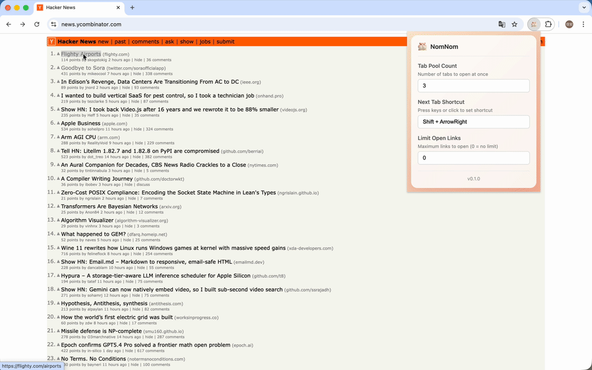

<p align="center">
  
</p>

# NomNom

[English](README.en.md) | 简体中文

一个 Chrome 浏览器扩展，像仓鼠一样收集和批量打开链接。Nom nom nom... all your links.

> **名字由来**：NomNom 源自英语中模拟吃东西的拟声词，常用于形容小动物（尤其是仓鼠）快速咀嚼食物的声音。这个扩展就像一只勤劳的仓鼠，帮你把网页上的链接一个个"吃掉"，囤进标签组里慢慢消化。



## 功能特性

- **链接分组**：右键点击链接，将页面中相似的链接聚集在一起
- **批量打开**：按设定数量分批打开链接，避免一次性打开过多标签
- **快捷键导航**：通过快捷键（默认 `Shift + →`）快速切换到下一个链接
- **进度追踪**：标签组标题自动显示"已访问/总数"的浏览进度
- **智能过滤**：可选择只分组未访问过的链接

## 安装

### 开发模式

1. 克隆项目并安装依赖：
   ```bash
   git clone <repo-url>
   cd nomnom
   npm install
   ```

2. 构建项目：
   ```bash
   npm run build
   ```

3. 加载扩展：
   - 打开 Chrome，进入 `chrome://extensions/`
   - 开启右上角的「开发者模式」
   - 点击「加载已解压的扩展程序」
   - 选择 `dist` 目录

### 开发模式（热更新）

```bash
npm run dev
```

## 使用方法

### 右键菜单

在网页中右键点击任意链接：

- **Nom links**：收集页面中所有相关链接
- **Nom unvisited links**：仅收集未访问过的链接

### 快捷键

| 快捷键 | 功能 |
|--------|------|
| `Shift + →` | 切换到下一个链接（可自定义） |

### 弹窗设置

点击扩展图标打开设置面板：

| 选项 | 说明 | 默认值 |
|------|------|--------|
| Tab Pool Count | 每次打开的标签数量 | 3 |
| Next Tab Shortcut | 切换下一个链接的快捷键 | Shift + → |
| Limit Open Links | 限制最大打开标签数（0 为不限制） | 0 |
| Store Locally | 使用本地存储（否则为会话存储） | 否 |

## 项目结构

```
nomnom/
├── src/
│   ├── shared/                # 共享模块
│   │   ├── types/             # TypeScript 类型定义
│   │   ├── utils/             # 工具函数
│   │   └── services/          # 共享服务
│   ├── background/            # 后台 Service Worker
│   │   ├── services/          # 菜单、标签组、Tab Pool
│   │   └── handlers/          # 消息处理
│   ├── content/               # 内容脚本
│   │   └── services/          # 链接收集、快捷键监听
│   └── popup/                 # 弹窗 UI
│       ├── components/        # UI 组件
│       └── styles/            # 样式
├── tests/                     # 测试
├── dist/                      # 构建输出
├── package.json
├── tsconfig.json
├── vite.config.ts
└── vitest.config.ts
```

## 技术栈

- **语言**: TypeScript
- **构建**: Vite + @crxjs/vite-plugin
- **测试**: Vitest
- **规范**: ESLint + Prettier
- **运行时**: Chrome Extension Manifest V3
- **API**: Chrome Tabs, Tab Groups, History, Storage, Context Menus

## 开发命令

| 命令 | 说明 |
|------|------|
| `npm run dev` | 开发模式（监听文件变化） |
| `npm run build` | 生产构建 |
| `npm run typecheck` | TypeScript 类型检查 |
| `npm run lint` | ESLint 检查 |
| `npm run lint:fix` | ESLint 自动修复 |
| `npm run format` | Prettier 格式化 |
| `npm run test` | 运行测试 |

## 使用指南

### 典型工作流程

1. **找到链接列表页面**

   打开任何包含多个链接的页面，如搜索结果、文章列表、论坛帖子等。

2. **收集链接**

   右键点击列表中的任意一个链接，选择 **Nom links** 或 **Nom unvisited links**。扩展会自动识别页面中与该链接相似的所有链接。

3. **自动打开标签组**

   收集完成后，扩展会自动创建一个 Chrome 标签组，并按 Tab Pool 设置的数量打开第一批链接。标签组名称显示为 `0/N`（N 为总链接数）。

4. **浏览并导航**

   - 在打开的标签页中浏览内容
   - 按快捷键（默认 `Shift + →`）跳转到下一个链接
   - 标签组名称自动更新进度，如 `3/10`

5. **自动补充**

   当前批次的链接全部访问完后，扩展会自动从队列中打开下一批链接，直到所有链接访问完毕。

### 使用技巧

- **大量链接时**：将 Tab Pool Count 设置为较小的值（如 3-5），避免同时打开过多标签
- **临时收集**：关闭 Store Locally 选项，链接数据仅保存在当前会话中
- **跳过已读**：使用 Nom unvisited links 可以跳过浏览器历史中已访问的链接
- **限制数量**：设置 Limit Open Links 可以限制最多收集的链接数量

### 适用场景

- 批量阅读搜索结果
- 浏览论坛/新闻列表
- 整理收藏的链接
- 顺序查看多个页面
- 阅读多章节文章或教程
- 批量查看商品详情

## License

MIT
